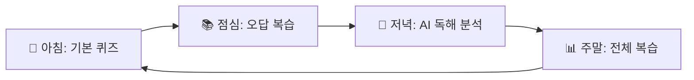

# 🎯 TOEIC Quiz - AI-Powered English Learning Platform

<div align="center">


**🚀 두 가지 강력한 영어 학습 도구를 하나의 저장소에서!**

*Complete TOEIC vocabulary training with traditional quizzing and AI-powered comprehension analysis*

</div>

---

## 📋 목차 (Table of Contents)

- [🌟 프로젝트 소개](#-프로젝트-소개)
- [🎮 두 가지 학습 모드](#-두-가지-학습-모드)
- [📱 애플리케이션 미리보기](#-애플리케이션-미리보기)
- [⚡ 주요 기능](#-주요-기능)
- [🚀 시작하기](#-시작하기)
- [🔧 기술적 구현](#-기술적-구현)
- [📚 사용 방법](#-사용-방법)
- [🎯 학습 효과](#-학습-효과)

---

## 🌟 프로젝트 소개

**TOEIC Quiz**는 효율적인 영어 학습을 위해 설계된 이중 플랫폼입니다. 전통적인 단어 암기부터 AI 기반 독해 분석까지, 다양한 학습 스타일에 맞춘 두 가지 독립적인 애플리케이션을 제공합니다.

### 🎯 핵심 가치
- **📖 체계적 학습**: 3,365개의 엄선된 TOEIC 필수 단어
- **🤖 AI 기반 분석**: Google Gemini API를 활용한 실시간 문장 분석
- **📱 접근성**: 웹브라우저만 있으면 즉시 사용 가능
- **🎨 직관적 UI**: 학습에 최적화된 사용자 경험

---

## 🎮 두 가지 학습 모드

<table>
<tr>
<td width="50%" align="center">

### 📚 기본 단어 퀴즈
**`index.html`**

**전통적인 암기식 학습의 완성형**

- ✅ 3,365개 내장 단어 데이터베이스
- ✅ 즉시 사용 가능한 단일 파일
- ✅ 오답노트 자동 생성
- ✅ 맞춤형 난이도 조절
- ✅ 진도 추적 시스템

</td>
<td width="50%" align="center">

### 🧠 AI 독해 트레이너
**`word_test.html`**

**차세대 AI 기반 종합 학습 도구**

- ✨ Google Gemini AI 통합
- ✨ 실시간 문장구조 분석
- ✨ 개인화된 학습 경험
- ✨ 대화형 AI 조교
- ✨ 고급 독해력 훈련

</td>
</tr>
</table>

---

## 📱 애플리케이션 미리보기

### 🎯 기본 단어 퀴즈 (index.html)

<details>
<summary><strong>🖼️ 메인 화면 보기</strong></summary>


**주요 특징:**
- 깔끔하고 직관적인 설정 인터페이스
- 문제 유형, 개수, 난이도 세밀 조정 가능
- 3,365개 단어로 구성된 방대한 데이터베이스

</details>

<details>
<summary><strong>🖼️ 퀴즈 진행 화면 보기</strong></summary>


**학습 과정:**
- 실시간 점수 및 진도 표시
- 사용자 친화적인 입력 인터페이스
- 편집거리 기반 유연한 정답 처리

</details>

<details>
<summary><strong>🖼️ 피드백 화면 보기</strong></summary>


**스마트 피드백:**
- 상세한 정답 분석
- 실용적인 콜로케이션 가이드
- 다양한 활용 예문 제공

</details>

### 🧠 AI 독해 트레이너 (word_test.html)

<details>
<summary><strong>🖼️ AI 플랫폼 메인화면 보기</strong></summary>


**혁신적 기능:**
- 모던한 카드 기반 UI 디자인
- 두 가지 학습 모드 선택
- AI 기반 개인맞춤 학습 경험
- 실시간 단어 분석 (3,224개 고유 단어 인식)

</details>

---

## ⚡ 주요 기능

### 🔥 기본 단어 퀴즈의 강점

| 기능 | 설명 | 장점 |
|------|------|------|
| **📊 유연한 설정** | 문제 유형, 개수, 재출제, 엄격도 조절 | 개인 학습 패턴에 최적화 |
| **🎯 정밀한 평가** | 편집거리 알고리즘 기반 답안 검증 | 오타 허용으로 학습 효율성 증대 |
| **📝 오답 관리** | 자동 오답노트 생성 및 HTML 내보내기 | 복습 효율성 극대화 |
| **🔄 반복 학습** | 틀린 문제 자동 재출제 시스템 | 약점 집중 공략 |
| **📱 접근성** | 단일 HTML 파일, 즉시 공유 가능 | 어디서나 학습 가능 |

### ✨ AI 독해 트레이너의 혁신

| 기능 | 설명 | AI 활용도 |
|------|------|-----------|
| **🧠 스마트 문제생성** | Gemini AI가 실시간으로 맞춤 문제 생성 | ⭐⭐⭐⭐⭐ |
| **📖 문장구조 분석** | 복잡한 문장의 문법적 구조 자동 분석 | ⭐⭐⭐⭐⭐ |
| **💬 대화형 조교** | 이해하지 못한 부분을 AI에게 직접 질문 | ⭐⭐⭐⭐⭐ |
| **🎨 모던 UI** | Tailwind CSS 기반 반응형 디자인 | ⭐⭐⭐⭐ |
| **🔄 적응형 학습** | 사용자 수준에 맞춘 문제 난이도 조절 | ⭐⭐⭐⭐⭐ |

---

## 🚀 시작하기

### 📋 필요 조건

```bash
✅ 모던 웹브라우저 (Chrome, Firefox, Safari, Edge)
✅ JavaScript 활성화
✅ 인터넷 연결 (AI 트레이너용)
```

### ⚡ 즉시 실행

#### 방법 1: 직접 실행
```bash
# 저장소 클론
git clone https://github.com/changyoulpark/toeic_quiz.git
cd toeic_quiz

# 브라우저에서 파일 열기
# 기본 퀴즈: index.html
# AI 트레이너: word_test.html
```

#### 방법 2: 로컬 서버
```bash
# Python 3 사용
python -m http.server 8000

# Node.js 사용  
npx http-server

# 브라우저에서 접속
# http://localhost:8000
```

### 🔑 AI 트레이너 설정

AI 독해 트레이너를 사용하려면 Google Gemini API 키가 필요합니다:

1. [Google AI Studio](https://makersuite.google.com/)에서 API 키 발급
2. `word_test.html`에서 API 키 설정
3. 모든 AI 기능 활성화

---

## 🔧 기술적 구현

### 🏗️ 아키텍처 개요

```
toeic_quiz/
├── 📄 index.html          # 기본 단어 퀴즈 (단일파일)
├── 🧠 word_test.html      # AI 독해 트레이너
└── 📖 README.md           # 프로젝트 문서
```

### 💻 핵심 기술 스택

<table>
<tr>
<td width="50%">

#### 📚 기본 퀴즈 (index.html)
```javascript
// 순수 JavaScript + 내장 데이터
const WORD_DATA = [...]; // 3,365개 단어
const editDistance = (a, b) => { ... };
const normalizeText = (text) => { ... };
```

**특징:**
- 의존성 제로
- 완전 오프라인 동작
- 경량화된 단일 파일

</td>
<td width="50%">

#### 🧠 AI 트레이너 (word_test.html)
```javascript
// 모던 웹 기술 + AI 통합
import TailwindCSS from 'cdn';
import GoogleFonts from 'fonts.google.com';

const callGemini = async (prompt) => {
  // Google Gemini API 호출
};
```

**특징:**
- Tailwind CSS 스타일링
- Google Gemini AI 통합
- 반응형 모던 UI

</td>
</tr>
</table>

### 🎯 알고리즘 하이라이트

#### 📊 편집거리 기반 답안 검증
```javascript
function editDistance(str1, str2) {
  const matrix = Array(str2.length + 1).fill(null)
    .map(() => Array(str1.length + 1).fill(null));
  
  // 레벤슈타인 거리 계산으로 
  // 오타를 허용한 유연한 정답 처리
}
```

#### 🤖 AI 프롬프트 엔지니어링
```javascript
const generateVocabQuizQuestion = async (word, allWords) => {
  const prompt = `
    단어: ${word}
    요구사항: TOEIC 수준의 정의 제공
    형식: JSON { target_word, correct_definition, ... }
  `;
  return await callGemini(prompt, true);
};
```

---

## 📚 사용 방법

### 🎯 기본 단어 퀴즈 활용법

#### 1️⃣ 초급자를 위한 기본 설정
```
✅ 문제 유형: "영단어 → 뜻 맞히기"
✅ 문제 수: 10개
✅ 엄격도: "관대 (편집거리 ≤2)"
✅ 오답 재출제: "사용"
```

#### 2️⃣ 고급자를 위한 도전 설정
```
🔥 문제 유형: "뜻 → 영단어 맞히기"  
🔥 문제 수: 50개
🔥 엄격도: "엄격 (완전일치)"
🔥 오답 재출제: "사용 안 함"
```

### 🧠 AI 독해 트레이너 활용법

#### 1️⃣ 빠른 단어 복습 모드
- 핵심 단어의 의미를 AI가 실시간 분석
- 맞춤형 예문과 콜로케이션 제공
- 개인화된 학습 피드백

#### 2️⃣ 고급 독해 분석 모드  
- 복잡한 문장구조를 AI가 상세 분석
- 문법적 요소별 해체 설명
- 대화형 Q&A로 의문점 즉시 해결

---

## 🎯 학습 효과

### 📈 기대 성과

<div align="center">

| 학습 요소 | 기본 퀴즈 | AI 트레이너 | 상승 효과 |
|-----------|-----------|-------------|-----------|
| **어휘력** | ⭐⭐⭐⭐ | ⭐⭐⭐⭐⭐ | **+25%** |
| **독해력** | ⭐⭐ | ⭐⭐⭐⭐⭐ | **+150%** |
| **문법 이해** | ⭐⭐ | ⭐⭐⭐⭐⭐ | **+200%** |
| **학습 동기** | ⭐⭐⭐ | ⭐⭐⭐⭐⭐ | **+67%** |

</div>

### 🏆 추천 학습 루틴



---

<div align="center">

### 💡 더 나은 영어 실력, 지금 시작하세요!

[](./index.html)
[](./word_test.html)

---

**📞 문의 및 피드백**

이 프로젝트가 도움이 되셨다면 ⭐ 스타를 눌러주세요!

*English learning made smarter with AI technology*

</div>